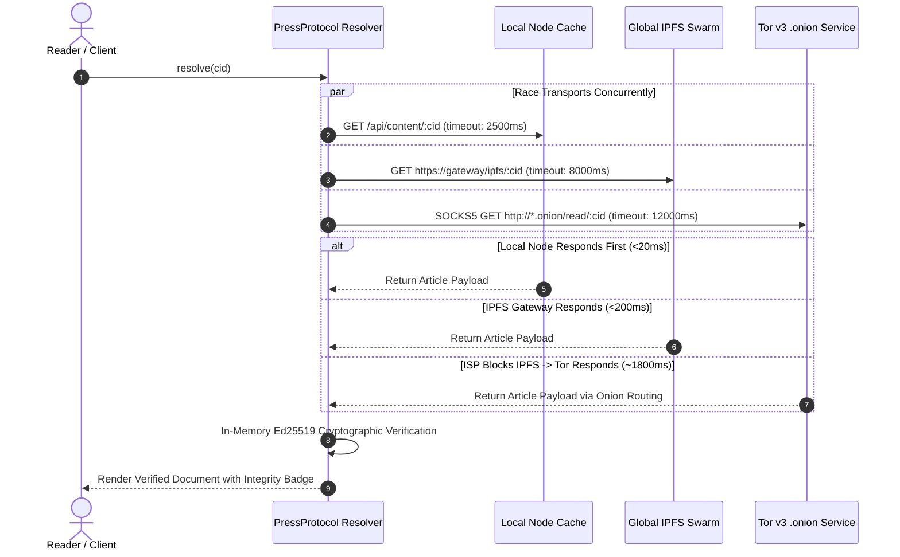

# PressProtocol Architecture Specification

> **RFC-PP-001 through RFC-PP-009 Comprehensive Protocol Architecture**  
> *Sovereign, Censorship-Resistant Publishing & Multi-Transport Resolution Rails*

---

## 1. Executive Protocol Overview

PressProtocol is a multi-transport, zero-custody decentralized publishing and archival protocol. It guarantees that any written document, journalistic investigation, whistleblower disclosure, or civic record can be permanently published, cryptographically verified, and reliably retrieved—even in the presence of aggressive network partitioning, national ISP blockades, DNS poisoning, cloud hosting deplatforming, or targeted state censorship.

Unlike previous attempts at decentralized publishing, PressProtocol makes three foundational architectural breakthroughs:

1. **Zero Crypto-Barrier & Zero-Custody Identity**: Publishers do not need cryptocurrency wallets, gas tokens, browser extensions, or KYC accounts. Keypairs are generated client-side using RFC 8032 Ed25519 in browser/device memory. The gateway functions purely as a zero-custody distribution engine.
2. **Multi-Transport Racing & Automatic Failover**: Content is not locked into a single transport. When resolving an article, the protocol client queries IPFS gateways, direct P2P IPFS swarms, Tor v3 `.onion` hidden services, and clearnet mirrors simultaneously, gracefully falling back without human intervention.
3. **Universal Content Rails**: The protocol integrates directly into the existing web via a drop-in 2-line Web Component (`<pressprotocol-publish>`), connectors for 7 major rich-text editors (TipTap, Lexical, Quill, TinyMCE, ProseMirror, Markdown, HTML), native plugins for WordPress (powering 43% of the internet) and Obsidian, a Chromium MV3 browser extension, a GitHub Action CI/CD publisher, and an OpenAPI 3.1.0 Enterprise Gateway with real-time signed webhooks.

---

## 2. High-Level Architecture Diagram

```
┌─────────────────────────────────────────────────────────────────────────────────────────────┐
│                                   PUBLISHER DISTRIBUTION RAILS                              │
│                                                                                             │
│   ┌──────────────────┐  ┌─────────────────┐  ┌──────────────────┐  ┌────────────────────┐   │
│   │ Next.js Web App  │  │ Universal Widget│  │ WordPress Plugin │  │ Chromium Extension │   │
│   │  (apps/web)      │  │ (<pressprotocol-│  │ (integrations/   │  │ (integrations/     │   │
│   │                  │  │  publish>)      │  │  wordpress)      │  │  browser-ext)      │   │
│   └─────────┬────────┘  └────────┬────────┘  └────────┬─────────┘  └─────────┬──────────┘   │
│             │                    │                    │                      │              │
│             │   ┌────────────────┴────────────────────┴──────────────────────┘              │
│             ▼   ▼                                                                           │
│   ┌─────────────────────────────────────────────────────────────────────────────────────┐   │
│   │                Client-Side Cryptographic Engine (@pressprotocol/sdk)                │   │
│   │  1. Content Sanitization (Strip commercial tracking pixels, UTM, fingerprinting)    │   │
│   │  2. Canonical JSON Serialization & Title/Tag Packaging                              │   │
│   │  3. Deterministic In-Memory CIDv1 Computation (multihash sha2-256 raw-codec Base32) │   │
│   │  4. RFC 8032 Ed25519 Signature Generation (Zero Private Key Transmission)           │   │
│   └──────────────────────────────────────────┬──────────────────────────────────────────┘   │
└──────────────────────────────────────────────┼──────────────────────────────────────────────┘
                                               │
                                               ▼
┌─────────────────────────────────────────────────────────────────────────────────────────────┐
│                            ENTERPRISE GATEWAY & SOVEREIGN NODE                              │
│                                 (core/node - Fastify Engine)                                │
│                                                                                             │
│  ┌───────────────────────────────────────────────────────────────────────────────────────┐  │
│  │ OpenAPI 3.1.0 REST API & Ingest Pipeline                                              │  │
│  │ - POST /api/v1/publish/signed   (Zero-Custody Swarm Distribution)                     │  │
│  │ - POST /api/v1/publish/raw      (Custodial Node-Signed Ingest)                        │  │
│  │ - GET  /api/v1/resolve/:cid     (Multi-Transport Swarm Resolver)                      │  │
│  │ - POST /api/v1/verify           (Mathematical Cryptographic Verification)             │  │
│  │ - GET  /api/v1/metrics          (Telemetry, Throughput & Circuit Health)              │  │
│  │ - Token-Bucket Rate Limiter     (Per-Key & Per-IP Quotas)                             │  │
│  └───────────────────────────────────────────┬───────────────────────────────────────────┘  │
│                                              │                                              │
│        ┌─────────────────────────────────────┼─────────────────────────────────────┐        │
│        ▼                                     ▼                                     ▼        │
│  ┌───────────┐                        ┌───────────┐                         ┌───────────┐   │
│  │ Blockstore│                        │ Tor v3    │                         │ Webhooks  │   │
│  │  Storage  │                        │ Hidden    │                         │ Event Bus │   │
│  │ (Memory + │                        │ Service   │                         │ (HMAC-    │   │
│  │  IPFS DHT)│                        │ Daemon    │                         │  SHA256)  │   │
│  └─────┬─────┘                        └─────┬─────┘                         └─────┬─────┘   │
└────────┼────────────────────────────────────┼─────────────────────────────────────┼─────────┘
         │                                    │                                     │
         ▼                                    ▼                                     ▼
┌─────────────────┐                  ┌─────────────────┐                  ┌───────────────────┐
│ Global IPFS     │                  │ The Onion       │                  │ Subscribed        │
│ Swarm & DHT     │                  │ Router (Tor)    │                  │ Newsrooms, Bots,  │
│ - Pinata        │                  │ - .onion hidden │                  │ Ghost, WordPress, │
│ - Cloudflare    │                  │   services      │                  │ & Webhook Hooks   │
│ - IPFS.io       │                  │ - Uncancellable │                  │ - Replay protected│
│ - Public nodes  │                  │   darknet mirror│                  │ - Signed headers  │
└────────┬────────┘                  └────────┬────────┘                  └───────────────────┘
         │                                    │
         └──────────────────┬─────────────────┘
                            │
                            ▼
┌─────────────────────────────────────────────────────────────────────────────────────────────┐
│                                    READER & RESOLUTION SURFACES                             │
│                                                                                             │
│   ┌───────────────────────────┐  ┌───────────────────────────┐  ┌───────────────────────┐   │
│   │ Multi-Transport Parallel  │  │ Air-Gapped Sovereign      │  │ Delay-Tolerant        │   │
│   │ Resolver (Browser / Ext)  │  │ Proofs (.pressproof.json) │  │ Optical QR Mesh       │   │
│   │ - Races IPFS vs Tor vs CDN│  │ - Offline cryptographic   │  │ - PPQR:1:* streaming  │   │
│   │ - Sub-150ms typical read  │  │   audit verification      │  │   chunk reassembly    │   │
│   │ - Auto-failover on ISP cut│  │ - Wayback Machine &       │  │ - Camera scanner for  │   │
│   │ - In-memory Ed25519 check │  │   Archive.today sync      │  │   air-gapped transfer │   │
│   └───────────────────────────┘  └───────────────────────────┘  └───────────────────────┘   │
└─────────────────────────────────────────────────────────────────────────────────────────────┘
```

---

## 3. Cryptographic Specification

### 3.1 Content Addressing & Deterministic Multihash (CIDv1)

PressProtocol rejects arbitrary database IDs or sequential counters. Every document is addressed by its cryptographic Content Identifier (CIDv1) computed deterministically in-memory according to the IPFS multiformats specification:

$$\text{CIDv1} = \text{Base32}\Big(\text{Multicodec}(\text{raw}, 0x55) \parallel \text{Multihash}(\text{sha2-256}, 0x12, 0x20) \parallel \text{SHA-256}(M)\Big)$$

- **Multibase**: `b` (RFC 4648 Base32 lowercase, unpadded).
- **Multicodec**: `0x55` (`raw` binary content).
- **Multihash Algorithm**: `0x12` (`sha2-256`).
- **Digest Length**: `0x20` (32 bytes / 256 bits).
- **Zero-Daemon Guarantee**: `@pressprotocol/sdk` calculates authentic CIDv1 strings client-side without initiating network calls to IPFS daemons.

### 3.2 Canonical Signing Envelope (RFC 8032 Ed25519)

Authors are identified by a 32-byte Ed25519 public key. Authenticity is mathematically bound to the article metadata and timestamp:

$$\text{Payload}_{\text{canonical}} = \text{JSON.stringify}\Big(\{\text{title}, \text{tags}, \text{timestamp}\}\Big)$$

$$\sigma = \text{Ed25519Sign}\Big(\text{Payload}_{\text{canonical}}, \text{PrivKey}\Big)$$

- **Algorithm**: Pure Ed25519 (RFC 8032) using SHA-512 for scalar reduction.
- **Representation**: 64-byte signature in hex (128 characters) and 32-byte public key in hex (64 characters).
- **Zero-Knowledge to Gateway**: In the `POST /api/v1/publish/signed` flow, the gateway receives only the public key and signature. The private key never leaves the client's volatile memory.

### 3.3 Outbound Webhook HMAC-SHA256 Signatures

Outgoing webhook callbacks use industry-standard HMAC-SHA256 signatures with timestamp binding:

$$\text{Header} = \text{"t="} \parallel t \parallel \text{",v1="} \parallel \text{HMAC-SHA256}\Big(\text{Secret}, t \parallel \text{"."} \parallel \text{Payload}_{\text{JSON}}\Big)$$

- **Replay Protection Window**: 300 seconds (5 minutes). Callbacks with timestamps drifting $> 300$ seconds into the past or future are rejected.
- **Timing-Safe Equality**: Verification uses `crypto.timingSafeEqual` in Node.js and constant-time byte loops in `@pressprotocol/sdk` to prevent side-channel timing attacks.

---

## 4. Multi-Transport Resolution Algorithm

When a user or client requests an article via CID (`pressprotocol://<cid>` or `/api/v1/resolve/<cid>`), PressProtocol runs an adaptive race across decentralized transports:



### Automatic Failover Logic

1. **Phase 1: Local Daemon Check**: If a local node daemon is running on `127.0.0.1:4000`, query local blockstore first.
2. **Phase 2: Global IPFS Swarm Race**: Query multiple public IPFS gateways in parallel (`Pinata`, `Cloudflare`, `IPFS.io`, `dweb.link`). First successful response aborts slower pending requests.
3. **Phase 3: Tor Onion Failover**: If clearnet IPFS gateways are unreachable (e.g., blocked by national firewall or ISP DPI), query the Tor v3 hidden service via SOCKS5 proxy.
4. **Phase 4: Cryptographic In-Memory Verification**: Validate the Ed25519 signature before handing content to the presentation layer. If the payload has been tampered with in transit by an untrusted gateway, it is flagged as `invalid` and discarded.

---

## 5. Protocol Wire Formats & Specifications

### 5.1 Canonical Sovereign Article Schema

```json
{
  "version": "1.0.0-sovereign",
  "cid": "bafkreifg43jdwfgeebl6fkt6ntem6xsw5pp54ttnuzb6rffil36jtjukq4",
  "title": "Global Environmental Transparency Dossier 2026",
  "content": "# Investigative Report\n\nFull findings detailing industrial pollution...",
  "tags": ["investigation", "climate", "sovereign"],
  "timestamp": "2026-09-13T01:00:00.000Z",
  "publisher": {
    "publicKey": "7f2a89b0c1d2e3f4a5b6c7d8e9f0123456789abcdef0123456789abcdef01234",
    "signature": "e5f93f123456789abcdef0123456789abcdef0123456789abcdef0123456789abcdef",
    "username": "Investigative Desk",
    "walletAddress": null,
    "isAnonymous": true
  },
  "mirrors": {
    "ipfs": "https://ipfs.io/ipfs/bafkreifg43jdwfgeebl6fkt6ntem6xsw5pp54ttnuzb6rffil36jtjukq4",
    "gateway": "http://127.0.0.1:4000/read/bafkreifg43jdwfgeebl6fkt6ntem6xsw5pp54ttnuzb6rffil36jtjukq4",
    "tor": "http://pressp42x7a6sover.onion/read/bafkreifg43jdwfgeebl6fkt6ntem6xsw5pp54ttnuzb6rffil36jtjukq4"
  },
  "verified": true,
  "verificationAlgorithm": "Ed25519 (RFC 8032 / SHA-512)"
}
```

### 5.2 Air-Gapped Sovereign Proof (`.pressproof.json`)

```json
{
  "$schema": "https://pressprotocol.com/schemas/pressproof-v1.json",
  "proofVersion": "1.0.0",
  "targetCid": "bafkreifg43jdwfgeebl6fkt6ntem6xsw5pp54ttnuzb6rffil36jtjukq4",
  "contentDigest": {
    "algorithm": "sha2-256",
    "hash": "8f434346648f6b96df89dda901c5176b10e6d83961dd3c1ac88b59b2dc327aa4",
    "rawBytes": 14920
  },
  "signatureProof": {
    "curve": "Ed25519",
    "rfc": "RFC-8032",
    "publicKey": "7f2a89b0c1d2e3f4a5b6c7d8e9f0123456789abcdef0123456789abcdef01234",
    "signature": "e5f93f123456789abcdef0123456789abcdef0123456789abcdef0123456789abcdef"
  },
  "provenance": {
    "generatedAt": "2026-09-13T01:05:00.000Z",
    "client": "@pressprotocol/proof v0.1.0",
    "airGapped": true
  },
  "archiveMirrors": {
    "waybackMachine": "https://web.archive.org/web/20260913010500/https://pressprotocol.com/read/bafkrei...",
    "archiveToday": "https://archive.today/2026.09.13/https://pressprotocol.com/read/bafkrei..."
  }
}
```

### 5.3 Delay-Tolerant Optical QR Mesh Codec (`PPQR:1:*`)

For physically disconnected environments, internet blackouts, or air-gapped devices, PressProtocol chunks content into high-density animated QR frames:

$$\text{Frame} = \text{"PPQR:1:"} \parallel \text{Seq} \parallel \text{":"} \parallel \text{Total} \parallel \text{":"} \parallel \text{CID} \parallel \text{":"} \parallel \text{Base64Chunk}$$

- **Format**: `PPQR:1:<seq>:<total>:<cid>:<chunk>`
- **Chunk Size**: Max 450 bytes per frame (optimized for standard mobile camera recognition at 10-15 FPS).
- **Reassembly Engine**: Client collects chunks out-of-order, verifies complete assembly, decodes the original JSON payload, and cryptographically audits the Ed25519 signature before rendering.

---

## 6. Threat Model & Adversarial Analysis

| Threat Vector | Real-World Attack Scenario | PressProtocol Defense Guarantee |
| :--- | :--- | :--- |
| **DNS Takedown / Domain Seizure** | ICANN or registrar seizes `pressprotocol.com` under legal or political pressure. | **Immune.** Content is addressed by immutable CID (`pressprotocol://[CID]`) or Tor v3 `.onion` hidden service. Domain name is never part of the content integrity hash. |
| **ISP Deep Packet Inspection (DPI)** | National firewall blocks IPFS gateway domains and clearnet IPs. | **Automatic Failover.** Protocol client detects connection failure and routes through Tor v3 onion service via encrypted multi-hop circuits. |
| **Cloud Hosting Deplatforming** | AWS, Cloudflare, or Vercel terminates host account. | **Decentralized Swarm.** Articles are pinned across multiple independent nodes, local publisher blockstores, and the global IPFS DHT. Any node can serve the content. |
| **Man-In-The-Middle (MITM) Tampering** | Malicious gateway or rogue proxy modifies article text to insert propaganda. | **Mathematical Cryptographic Rejection.** Client recalculates CIDv1 multihash and checks Ed25519 signature. If a single character is modified, verification fails and content is blocked. |
| **Publisher Deanonymization** | State actors analyze on-chain wallet transactions to unmask author. | **Zero-Custody / No Blockchain.** PressProtocol requires no wallet, no gas, and no on-chain ledger entries. Authors generate keys client-side; publishing can route through Tor SOCKS5. |
| **Replay & Timestamp Manipulation** | Attacker intercepts signed webhooks and replays them to trigger duplicate events. | **HMAC Drift Window.** Webhooks include timestamp header `t=...`; payloads drifting $>300$ seconds are discarded. |
| **Commercial Surveillance Tracking** | Third-party tracking scripts, Meta pixels, or Google Analytics identify readers. | **Automated Surveillance Stripper.** Ingest pipeline scans and cleans tracking pixels, redirect wrappers, and UTM parameters prior to cryptographic hashing. |

---

## 7. Enterprise Gateway ("Stripe for Publishing")

The PressProtocol Gateway (`core/node`) provides an HTTP RESTful interface under OpenAPI 3.1.0 with enterprise-grade token-bucket rate limiting, SHA-256 API key authentication, and real-time signed webhooks:

### Ingest Endpoints
- `POST /api/v1/publish/raw`: Custodial ingest for backend bots and automated pipelines. Signs with node identity, calculates deterministic CIDv1 in-memory, and broadcasts to IPFS and Tor.
- `POST /api/v1/publish/signed`: Zero-custody ingest. Accepts pre-signed client payloads. Node distributes across the swarm without possessing author private keys.

### Resolution & Verification
- `GET /api/v1/resolve/:cid`: Resolves content across local storage, Tor hidden services, and public IPFS gateways. Returns content and active mirror health telemetry.
- `POST /api/v1/verify`: Instant RFC 8032 cryptographic verification audit for any text string, CID, and signature tuple.

### Real-Time Outbound Webhooks
- `POST /api/v1/webhooks/subscriptions`: Register HTTP endpoint to receive signed callbacks.
- `GET /api/v1/webhooks/subscriptions`: List registered subscriptions and delivery telemetry.
- `DELETE /api/v1/webhooks/subscriptions/:id`: Revoke subscription.
- `POST /api/v1/webhooks/subscriptions/:id/test`: Trigger immediate live test ping.
- **Event Bus Topics**: `article.published`, `article.verified`, `mirror.health_changed`, `*`.
- **Delivery Engine**: 6s timeout, exponential backoff retry on 5xx or network drops, delivery statistics tracking (`deliveredCount`, `failureCount`, `lastLatencyMs`).

---

## 8. Monorepo Architecture & Package Structure

The PressProtocol monorepo is organized using `pnpm` workspaces, maintaining strict modular boundaries between core daemons, client packages, native CMS integrations, and multi-language SDKs:

```
PressProtocol/
├── apps/
│   └── web/                         # Next.js 15 Web Application & Developer Portal
│       ├── src/app/developers/      # /developers Interactive Playground & Sandbox Keys
│       ├── src/app/downloads/       # One-click client package downloads & checksums
│       ├── src/app/import/          # Notion, Substack, Medium & RSS Ingestion Rails
│       ├── src/app/vault/           # Offline-First Encrypted IndexedDB Reading Vault
│       └── src/components/          # UI Component Suite & Live Widget Sandbox
├── core/
│   ├── node/                        # Self-Sovereign Private Node Daemon (Fastify)
│   │   ├── src/routes/v1.ts         # OpenAPI 3.1.0 Enterprise Gateway ("Stripe for Publishing")
│   │   ├── src/services/            # ApiKey, Identity, Storage, Tor, Webhook Services
│   │   └── src/lib/                 # Deterministic CIDv1, Webhook Crypto, Proof Engine
│   └── worker/                      # Cloudflare Edge Gateway (api.pressprotocol.com)
│       ├── src/index.ts             # Hono Edge Router & Multi-Gateway Race Resolver
│       ├── src/services/pinata.ts   # Edge IPFS Pinning Engine
│       └── wrangler.toml            # Edge Routing & Observability Config
├── packages/
│   ├── sdk/                         # @pressprotocol/sdk (Headless TS SDK & CLI)
│   ├── widget/                      # @pressprotocol/widget (Universal Web Component)
│   └── proof/                       # @pressprotocol/proof (.pressproof.json & QR Codec)
├── integrations/
│   ├── wordpress-plugin/            # Native WordPress Plugin (Gutenberg & Classic)
│   ├── browser-extension/           # Chromium MV3 Sovereign Web Clipper & URI Handler
│   ├── obsidian-plugin/             # Native Obsidian Vault Plugin
│   └── publish-action/              # Official GitHub Action for CI/CD Archival
├── sdks/
│   ├── python/                      # Official Python Client Library (pressprotocol-py)
│   ├── go/                          # Official Go Client Library (PressProtocol/sdks/go)
│   └── rust/                        # Official Rust Client Library (pressprotocol-rs)
├── scripts/
│   ├── test.sh                      # Master Verification Test Harness (14/14 Suites)
│   └── install-node.sh              # 1-Command Sovereign Node Installer
├── ARCHITECTURE.md                  # Comprehensive Protocol Architecture Specification
├── INTEGRATIONS.md                  # Distribution Rails & Integrations Reference Guide
└── CONTRIBUTING.md                  # Open Source Contribution Guidelines & PR Workflow
```

